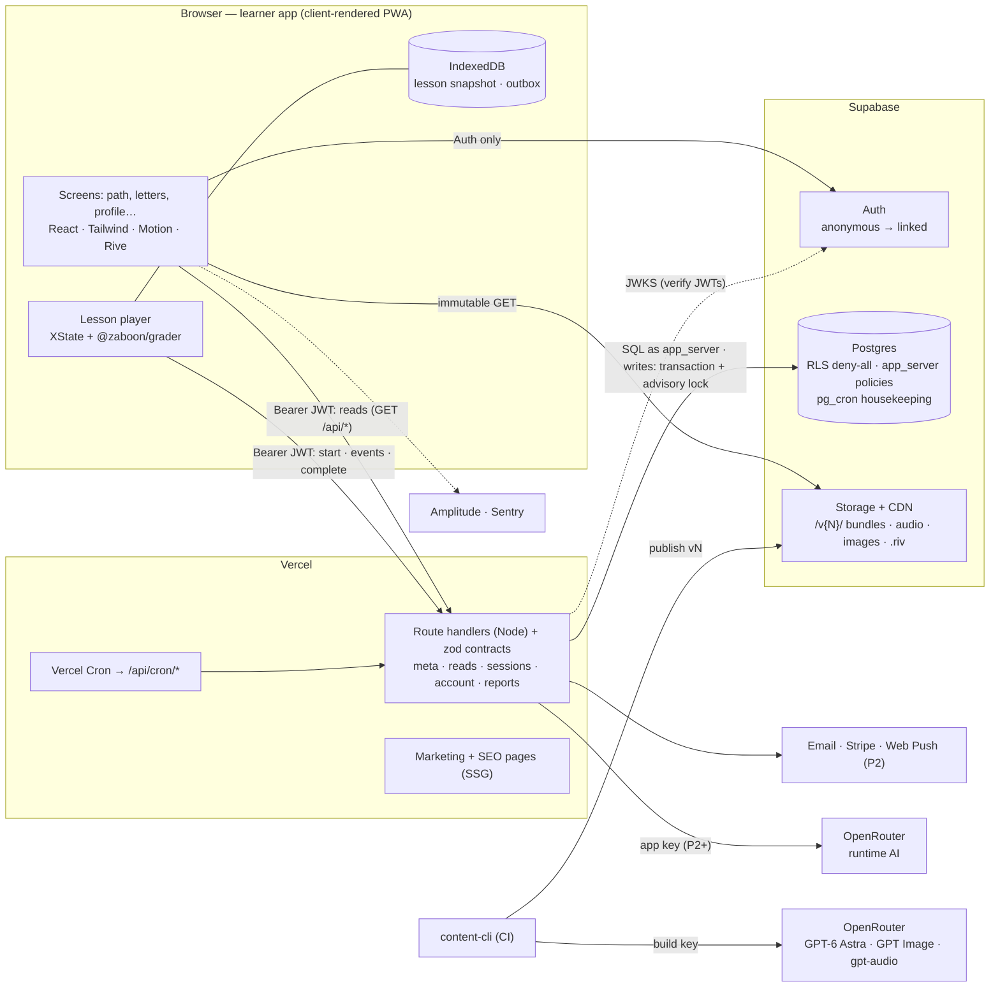
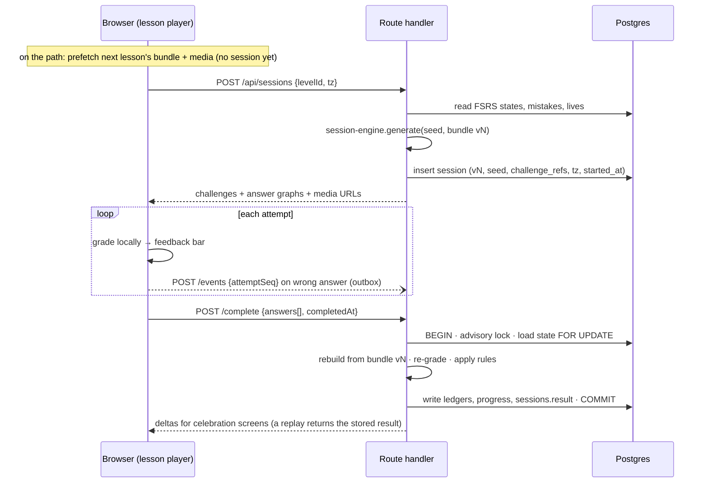
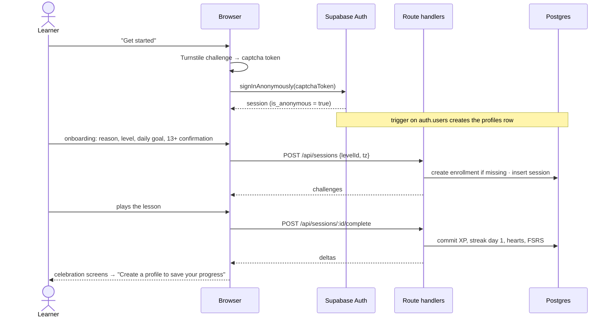
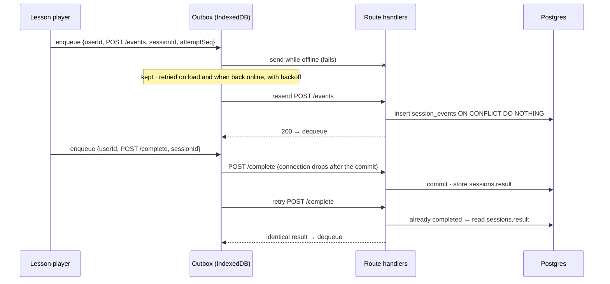
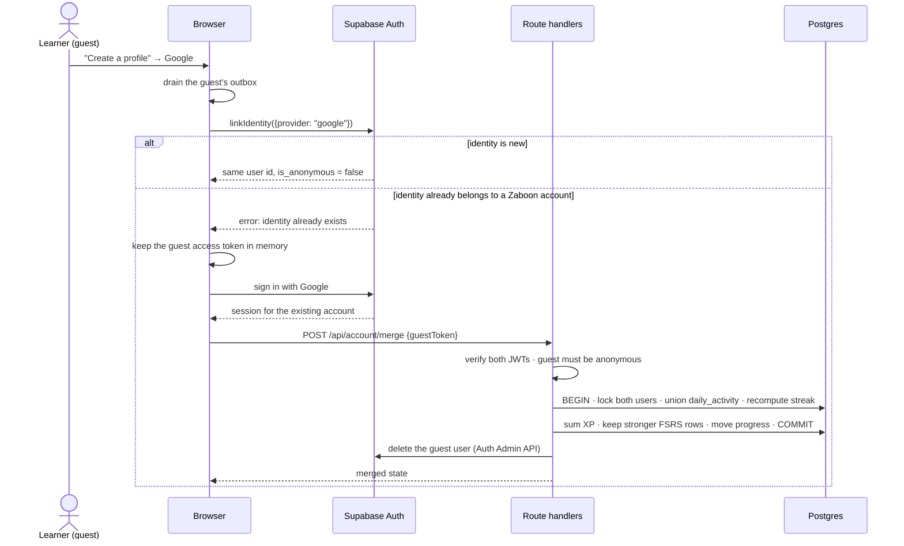
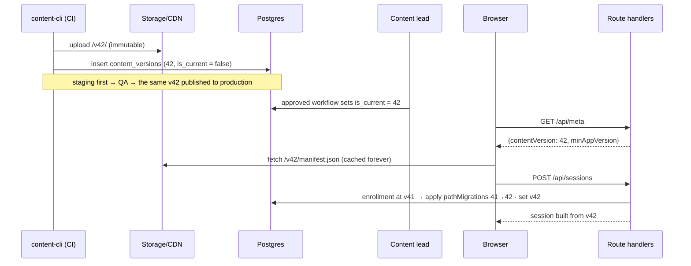
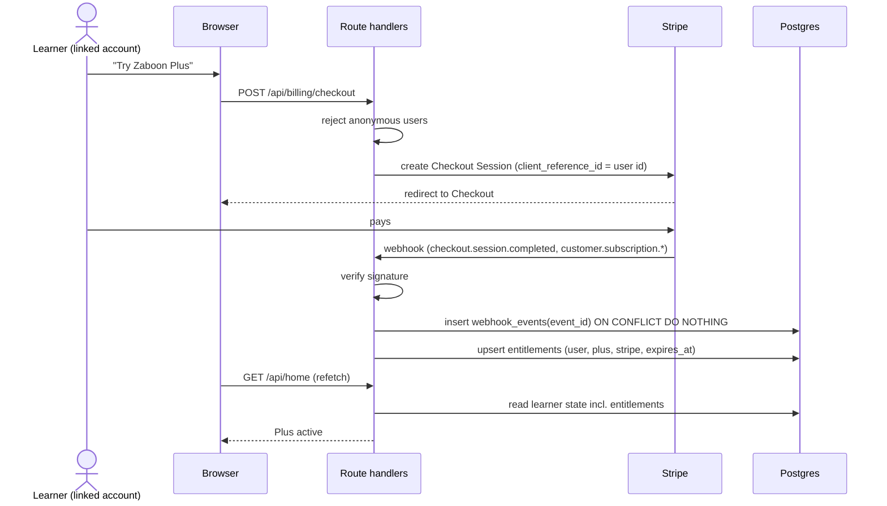
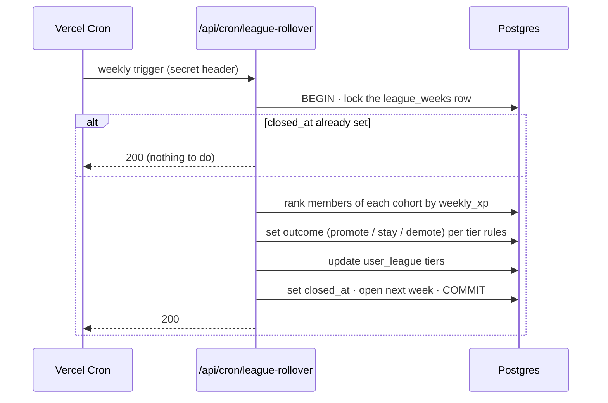

# Zaboon — System Architecture

> Status: **accepted; implementation in progress** (see [PROGRESS](PROGRESS.md)) · Last updated: 2026-09-25
>
> Companion documents: [Design system](DESIGN-SYSTEM.md) · [Learning engine](LEARNING-ENGINE.md) · [Decision records](adr/)

Zaboon (زبون, the colloquial Tehrani way of saying *zabān*, "language") is a web app that teaches
Persian (Farsi) to English speakers. It is **structurally modeled on Duolingo**: a learning path,
a lesson player with word-bank tiles, hearts, streaks, XP, leagues, chunky 3D buttons and animated
characters. It has its **own palette, mascot and cast**, and it is built around what makes Persian
different: a right-to-left script, the gap between colloquial and formal Persian, and the need for
transliteration while learners learn to read.

**Market gap:** as of Sept 2026, Duolingo teaches Arabic, Hebrew, Hindi and Yiddish from English,
but not Persian.

## Contents

1. [Confirmed product decisions](#1-confirmed-product-decisions)
2. [Decisions at a glance](#2-decisions-at-a-glance)
3. [System overview](#3-system-overview)
4. [Repository layout](#4-repository-layout)
5. [Data model](#5-data-model)
6. [Game rules](#6-game-rules)
7. [API](#7-api)
8. [Scheduled jobs](#8-scheduled-jobs)
9. [Security and RLS](#9-security-and-rls)
10. [Key flows](#10-key-flows)
11. [AI integration (OpenRouter)](#11-ai-integration-openrouter)
12. [Cross-cutting concerns](#12-cross-cutting-concerns)
13. [Environments, CI/CD and secrets](#13-environments-cicd-and-secrets)
14. [Roadmap and risks](#14-roadmap-and-risks)
15. [Architecture acceptance tests](#15-architecture-acceptance-tests)

---

## 1. Confirmed product decisions

| Decision | Choice | Record |
|---|---|---|
| Platform | **Web only for now**: a responsive, installable PWA. Native apps may come later | [ADR 0001](adr/0001-web-first-nextjs-pwa.md) |
| Backend | **Supabase** | [ADR 0002](adr/0002-supabase-server-authoritative-writes.md) |
| Data access | **Every read and write goes through our route handlers**, typed by zod contracts. The browser uses Supabase only for Auth, and RLS denies the browser's roles everything | [ADR 0009](adr/0009-api-first-data-access.md) |
| Register | **Colloquial (Tehrani) Persian first**, with formal/written forms layered alongside | [ADR 0003](adr/0003-colloquial-first-register-model.md) |
| Script | **Persian script from day 1**, a transliteration aid that fades, and a Letters tab | [ADR 0004](adr/0004-script-first-transliteration-fade.md) |
| AI | **Everything goes through OpenRouter**, with separate keys for the build pipeline and the app. Course materials: `openai/gpt-6-astra`. Assets: the latest GPT Image, `openai/gpt-5.4-image-2` | [ADR 0008](adr/0008-ai-via-openrouter.md) |

## 2. Decisions at a glance

| Area | Decision |
|---|---|
| Client | **Next.js (App Router) + React + TypeScript** on **Vercel**. Marketing pages are statically generated; the **learner app is client-rendered** and installable as a PWA |
| UI | Tailwind CSS v4 on design tokens · **Motion** (UI transitions) · **Rive** (characters) · **Howler.js** (sound-effect sprite) |
| Client state | TanStack Query (server data) · **XState** (lesson player) · Zustand (UI preferences) |
| Backend | **Supabase**: Postgres + RLS, Auth (anonymous guest → linked account), Storage + CDN, pg_cron |
| Writes | Route handlers validate the request against a zod contract (`packages/contracts`), own a **Postgres transaction** (Drizzle over postgres.js through Supavisor transaction mode) and run the shared TS rules under a per-user advisory lock. Each rule has exactly one implementation |
| Reads | **Also through route handlers** (`GET /api/home`, `/api/path`, …), typed by the same contracts. The browser uses supabase-js **only for Auth** and never queries PostgREST; RLS denies `anon` and `authenticated` everything ([ADR 0009](adr/0009-api-first-data-access.md)) |
| Monorepo | pnpm + Turborepo, with just-in-time internal packages (no per-package build step) |
| Content | Course source written as **YAML in git**, validated with zod, compiled to **immutable versioned JSON bundles** and audio on a CDN ([ADR 0005](adr/0005-content-as-code-immutable-bundles.md)) |
| AI (build pipeline) | **OpenRouter**, key `OPENROUTER_API_KEY_BUILD` (content CI and local dev only). Text: `openai/gpt-6-astra`. Images: `openai/gpt-5.4-image-2`. Draft audio: `openai/gpt-audio` |
| AI (app runtime) | **OpenRouter**, separate key `OPENROUTER_API_KEY_APP` (Vercel, server-only), used from P2 onward |
| Audio | Native voice actors for core content. Draft and long-tail audio from `openai/gpt-audio`, **gated by a native listening test** |
| Spaced repetition | **FSRS** via `ts-fsrs` for each learner × lexeme and each learner × letter ([ADR 0006](adr/0006-fsrs-spaced-repetition.md)) |
| Lives | **Hearts** in the MVP, behind a `LivesPolicy` interface ([ADR 0007](adr/0007-hearts-mvp-lives-policy.md)) |
| Payments (P2) | Stripe behind an `entitlements` table; add RevenueCat if native apps ship |
| Ops | Amplitude · Sentry · Vercel Cron + pg_cron |
| Testing | Vitest · pgTAP · Playwright (Chromium + WebKit) |

**Phase tags** used throughout: **MVP** = public beta (Phase 1), **P2** = engagement and revenue,
**P3** = scale. Phase 0 is the foundations work that makes the MVP possible (§14).

---

## 3. System overview



### 3.1 Core rules

1. **Reads and writes both go through the server** ([ADR 0009](adr/0009-api-first-data-access.md)).
   - The browser uses Supabase only for Auth and never queries PostgREST. Screens read through route handlers (`GET /api/home`, `/api/path`, … §7), and every request and response is a zod contract from `packages/contracts`.
   - Every route handler verifies the Bearer JWT against the project's JWKS with `jose` (asymmetric signing keys, so verification is local; §9), and every user-scoped repository method takes the caller's `userId`.
   - Every change to game state runs in **one Postgres transaction** under `pg_advisory_xact_lock(user)`, using the shared TS rules in `game-rules` and `srs`.
   - The client runs the same rules only for optimistic display, then shows the deltas the server returns.
2. **Grading happens locally; the server re-grades for consistency.**
   - Answer keys ship to the client so feedback is instant, which means re-grading can't stop someone looking answers up. Anti-cheat therefore relies on plausibility checks (§9).
   - If the server disagrees with a verdict the learner already saw, the learner's verdict stands when their `graderVersion` is in the supported window (the last N versions). The mismatch is logged.
3. **Content is immutable and versioned.**
   - `/v{N}/` bundles are cached forever.
   - A session stores only `content_version + seed + challenge_refs` and is rebuilt from the immutable bundle for re-grading.
   - The current version and `minAppVersion` come from `GET /api/meta` (sent with `no-store`), never from a cached file.
   - Below `minAppVersion`, the API returns HTTP 426 and the app shows an "Update available" prompt.
   - Each enrollment records its content version, and `pathMigrations` are applied lazily.
4. **Domain packages are framework-agnostic.** A lint rule bans react, next and DOM imports in `farsi`, `grader`, `session-engine`, `srs`, `game-rules` and `content-schema`, so a future native app can reuse them unchanged.
5. **Region pinning.** Route handlers set `preferredRegion` to the Supabase database's region, which keeps the extra hop that reads now take short.

### 3.2 Lesson lifecycle



---

## 4. Repository layout

```
zaboon/
├─ apps/web/                     # Next.js: learner app + marketing + API route handlers
│  └─ app/
│     ├─ (marketing)/            # landing, /learn-persian, /alphabet/[letter] (SSG, SEO)
│     ├─ (app)/                  # client-rendered: learn, letters, practice, leaderboard, quests, shop, profile, settings
│     ├─ lesson/[sessionId]/     # full-screen lesson player (no app chrome)
│     ├─ onboarding/ · admin/    # admin = report triage (role-gated)
│     └─ api/                    # meta, reads (home, path, letters, words, profile, settings, …), sessions, account,
│                                #   reports, admin, cron, billing, webhooks, push, ai; dev/ (local auth mode only, *.dev.ts)
├─ packages/
│  ├─ ui/                        # tokens.json → CSS vars/Tailwind theme; 3D component kit
│  ├─ farsi/                     # normalization pipeline, tokenizing, transliteration, keyboard layouts
│  ├─ grader/                    # accepted-answer pattern compiler + matcher
│  ├─ content-schema/            # zod schemas + TS types (authoring YAML and compiled bundles)
│  ├─ contracts/                 # zod request/response contracts shared by route handlers and the browser
│  ├─ session-engine/            # deterministic session builder
│  ├─ srs/                       # ts-fsrs wrapper, outcome→rating mapping
│  ├─ game-rules/                # XP, streak/day math, lives, quests — pure functions
│  ├─ db/                        # Drizzle schema (introspected) + withUserLock(); repositories (every user-scoped method takes a userId)
│  ├─ ai/                        # OpenRouter client (OpenAI-compatible), ai.models.yaml registry, versioned prompts,
│  │                             #   zod structured outputs; never reads env; the caller passes in its own key
│  └─ config/                    # tsconfig, eslint (incl. no-DOM rule for domain packages)
├─ content/fa-en/                # course.yaml, letters.yaml, units/, lexemes/, sentences/, characters/,
│                                #   guidebooks/*.md, orthography-variants.yaml, tests/grading.yaml, STYLE.md,
│                                #   style-bible/ (approved references), assets/ (approved art + provenance sidecars)
├─ content/fixtures/             # frozen fixture course for e2e: all 13 MVP challenge types, never AI-generated
├─ tools/content-cli/            # draft · suggest · art · tts · audio · validate · build · publish · models
├─ scripts/                      # db-local.sh (native Postgres 16, no Docker) · migrate.ts (local migrations) · verify.sh
├─ supabase/                     # migrations/ (schema, RLS, grants, pg_cron), tests/ (pgTAP), seed.sql,
│                                #   local/shim.sql (local only: Supabase roles, auth schema, default grants)
└─ docs/                         # this documentation + ADRs
```

---

## 5. Data model

All tables live in the `public` schema with RLS enabled. Server-only SQL helpers live in
`internal`; RLS helper functions live in `rls` (see §9). The browser never reads or writes tables
directly: route handlers do both, as `app_server`.

### 5.1 MVP tables

| Table | Key columns | Notes |
|---|---|---|
| `profiles` | `user_id` (PK → `auth.users`), `timezone`, `tz_changed_at`, `age_confirmed`, `daily_goal_xp`, `settings` JSON (transliteration, vowel marks, sound, motion, keyboard layout) | Private to its owner. Created by a trigger on `auth.users` insert |
| `public_profiles` | `user_id`, `username` (unique), `display_name`, `avatar` JSON, `streak_current`, `xp_total` | The only profile data other users can read |
| `consents` | `user_id`, `kind` (analytics, marketing), `granted`, `updated_at` | Consent for EU analytics |
| `enrollments` | (`user_id`, `course_id`) PK, `current_level_id`, `xp_total`, `content_version` | `content_version` drives lazy path migrations |
| `level_progress` | (`user_id`, `level_id`) PK, `lessons_done`, `legendary`, `updated_at` | |
| `sessions` | `id`, `user_id`, `level_id`, `kind` (lesson, practice, legendary, unit_review, letters), `content_version`, `seed`, `challenge_refs`, `tz`, `started_at`, `expires_at`, `status` (started, completed, expired), `result` JSON, `grader_version` | `result` is returned verbatim on replay |
| `session_events` | (`session_id`, `attempt_seq`) unique, `kind`, `created_at` | Idempotent wrong-attempt events |
| `session_answers` | `session_id`, `idx`, `attempt_seq`, `challenge_type`, `item_refs`, `response`, `verdict`, `ms` | Kept for 90 days, rolled up into `item_stats` |
| `daily_activity` | (`user_id`, `local_date`) PK, `xp`, `sessions`, `goal_met`, `freeze_used` | The source of truth for streaks |
| `streaks` | `user_id` PK, `current`, `longest`, `last_active_date`, `freezes_available` | Written only at commit |
| `xp_ledger` | `id`, `user_id`, `amount`, `reason`, `session_id`, `occurred_at`, `local_date` | Append-only |
| `lives` | `user_id` PK, `policy` (`hearts`), `count`, `updated_at` | Regeneration is computed lazily |
| `user_items` | (`user_id`, `item`) PK, `qty` | Streak freezes in the MVP |
| `lexeme_memory` | (`user_id`, `lexeme_id`) PK, FSRS fields (`stability`, `difficulty`, `due`, `reps`, `lapses`, `state`, `last_review`) | |
| `letter_memory` | (`user_id`, `letter_id`) PK, the same FSRS fields | Also drives the transliteration fade |
| `mistakes` | (`user_id`, `item_ref`) PK, `times_wrong`, `last_wrong_at`, `resolved_at` | Feeds practice sessions |
| `content_versions` | `version` PK, `bundle_path`, `min_app_version`, `is_current`, `published_at` | Served by `GET /api/meta` |
| `app_config` | `key` PK, `value` JSON | XP values, heart regeneration, mix profiles, feature flags |
| `reports` | `id`, `user_id`, `session_id`, `item_ref`, `kind`, `text`, `status` (new, accepted, rejected), `created_at` | "My answer should be accepted", audio issues |
| `item_stats` | (`item_ref`, `content_version`) PK, `attempts`, `error_rate`, `top_wrong_answers` | Nightly roll-up for content QA |

### 5.2 P2 tables

| Table | Key columns | Notes |
|---|---|---|
| `wallet` | `user_id` PK, `coins` | |
| `coin_ledger` | `id`, `user_id`, `amount`, `reason`, `created_at` | Append-only |
| `league_weeks` | `id`, `starts_at`, `ends_at`, `closed_at` | `closed_at` makes rollover idempotent |
| `league_cohorts` | `id`, `week_id`, `tier`, `size` | At most 30 members |
| `league_members` | (`cohort_id`, `user_id`) PK, `weekly_xp`, `final_rank`, `outcome` | |
| `user_league` | `user_id` PK, `tier` | |
| `quest_defs` | `id`, `template`, `target`, `reward` | |
| `user_quests` | (`user_id`, `date`, `quest_id`) PK, `progress`, `claimed` | |
| `entitlements` | (`user_id`, `entitlement`) PK, `source`, `expires_at` | Fed by Stripe, later RevenueCat |
| `webhook_events` | `event_id` PK, `type`, `received_at` | Stripe webhook de-duplication |
| `push_subscriptions` | `id`, `user_id`, `endpoint`, `keys`, `created_at` | Web Push |
| `speech_usage` | (`user_id`, `day`) PK, `count`, `updated_at` | P2 speak: transcriptions per learner per UTC day (`AppConfig.speech.dailyQuota`); never audio or transcripts |

---

## 6. Game rules

All rules are pure TypeScript functions in `packages/game-rules`. The server is authoritative and
every number comes from `app_config`.

- **What the commit transaction writes (MVP):**
  - session status and `result`;
  - `xp_ledger` and `daily_activity`;
  - the streak, consuming freezes to cover missed days;
  - hearts reconciliation: server-graded wrong answers whose events never arrived still cost hearts;
  - FSRS rows, `mistakes`, `level_progress` and enrollment XP.
  - P2 adds league XP, quests and coins.
- **Local date:**
  - The client's `completedAt` is clamped to [session start, now] and converted in the **timezone captured at session start**. A lesson finished at 23:55 whose request only lands at 00:10 still counts for the right day.
  - Timezone updates arrive with `POST /api/sessions` and are accepted at most once per 24 hours, which stops streak gaming by switching timezones.
- **Streak:**
  - +1 for the first completed lesson of a local day.
  - **Reads never write.** Display state ("12 days; a freeze will cover yesterday") comes from a pure function over `streaks` and `daily_activity`. Freeze consumption is written at the next commit.
  - Up to 2 freezes. In the MVP they are granted (one at signup, one per 7-day streak); in P2 they can also be bought with coins.
- **Hearts (MVP):**
  - 5 max, and −1 per wrong attempt. Events are keyed on `(session_id, attempt_seq)`, so a re-queued retry gets a new sequence number and still costs a heart.
  - Hearts regenerate lazily over time, and a practice session earns one back.
  - In P2, coins refill hearts and Zaboon Plus makes them unlimited.
  - Duolingo's "energy" model (mobile, since July 2025) stays behind the `LivesPolicy` interface as a P2 experiment.
- **XP:** a base amount per session kind plus an accuracy bonus.
- **Leagues (P2):**
  - A learner joins a cohort on their first XP of the week, under `pg_advisory_xact_lock(week, tier)`, which fills the **fullest open cohort** (fewer than 30 members). This avoids the cohort fragmentation that `SKIP LOCKED` causes under bursts.
  - No timezone banding until there's enough volume; at beta scale it would produce three-person leagues.
  - Rollover is idempotent through `league_weeks.closed_at`.
  - Joining requires a linked account.
  - Tiers are named after Persian gems and metals: Mes, Noqreh, Talā, Firouzeh, Aqiq, Lājvard, Yāqut, Zomorrod, Morvārid, Almās.
  - The leaderboard (`GET /api/leaderboard`) refetches on focus and after each lesson; no Realtime subscription.
- **Quests (P2):** 3 daily quests drawn from templates with a deterministic per-user seed.

---

## 7. API

All route handlers validate input against the zod contracts in `packages/contracts`, which also
type their responses. They verify the Bearer JWT (§9), apply per-user rate limits and set
`preferredRegion` to the database region. Reads go through them too: the browser never queries
PostgREST ([ADR 0009](adr/0009-api-first-data-access.md)).

| Endpoint | Phase | Purpose |
|---|---|---|
| `GET /api/meta` | MVP | `contentVersion`, `minAppVersion` and public config (`Cache-Control: no-store`) |
| `GET /api/home` | MVP | The app shell's state: the learner (guest or linked), streak display state (§6), hearts, XP, daily-goal progress and current level |
| `GET /api/path` | MVP | The learning path at the learner's content version, with each level's state and lessons done |
| `GET /api/letters` | MVP | Letters tab: each letter's strength (from `letter_memory`) and the letter lessons |
| `GET /api/words` | MVP | Words list with strength bars, from `lexeme_memory` |
| `GET /api/profile` | MVP | The learner's profile and stats |
| `GET` · `PATCH /api/settings` | MVP | Read and update settings: transliteration, vowel marks, sound, motion, keyboard layout, daily goal |
| `POST /api/sessions` | MVP | Generate a lesson or practice session. Also carries timezone updates |
| `POST /api/sessions/:id/events` | MVP | Record a wrong attempt, idempotent on `(session, attemptSeq)` |
| `POST /api/sessions/:id/complete` | MVP | Re-grade, commit, return the deltas. A replay returns the stored `result` |
| `POST /api/account/merge` | MVP | Merge a guest into an existing account (both JWTs verified) |
| `GET /api/account/export` · `DELETE /api/account` | MVP | GDPR export and delete |
| `POST /api/reports` · `GET/PATCH /api/admin/reports` | MVP | Content reports; triage requires the admin role claim |
| `/api/cron/*` | MVP/P2 | Vercel Cron jobs, authenticated by a secret header (§8) |
| `GET /api/leaderboard` | P2 | The learner's own league cohort: public profile fields and weekly XP |
| `GET /api/quests` | P2 | Today's quests and their progress |
| `POST /api/lives/refill` · `POST /api/shop/purchase` | P2 | Spend coins |
| `POST /api/billing/checkout` · `POST /api/billing/portal` · `POST /api/webhooks/stripe` | P2 | Zaboon Plus → `entitlements` (signature check + `webhook_events` de-duplication) |
| `POST /api/push/subscribe` | P2 | Store a Web Push subscription |
| `POST /api/speech/transcribe` | P2 | Transcription for `speak` challenges (OpenRouter app key). Takes a 16 kHz mono 16-bit WAV whose duration the server measures; a daily quota per learner is given back only when the provider refuses the call |
| `POST /api/ai/explain` · `POST /api/ai/roleplay` | P3 | OpenRouter app key; per-user quotas |
| `/api/dev/auth/*` | **Local only** | Sign-in for `AUTH_MODE=local` (§12). Its `*.dev.ts` route files are compiled only when a build-time flag enables them; a production build returns 404 |

**Error conventions:** 401 (no or invalid JWT, or the token of an account that no longer exists),
403 (anonymous user on a profile-only feature, missing admin claim), 404 (unknown or another
user's resource), 409 (a write that conflicts with state, e.g. a taken username or an event for a
completed session), 410 `gone` (the session expired), 426 (client below `minAppVersion`), 429 (rate
limit). A `/complete` replay always returns the stored result with 200, whatever its payload: the
first commit wins, which is what makes the offline outbox safe to retry.

---

## 8. Scheduled jobs

| Job | Runner | Phase | Notes |
|---|---|---|---|
| Prune `session_answers` older than 90 days | pg_cron | MVP | Pure SQL (`internal.prune_session_answers()`) |
| Roll up `item_stats` | pg_cron | MVP | Nightly |
| Expire stale sessions | pg_cron | MVP | `status = 'expired'` after the 24-hour TTL |
| Delete anonymous users inactive for 30+ days | Vercel Cron → `/api/cron/guest-cleanup` | MVP | Supabase has no automatic cleanup; uses the Auth Admin API |
| "Streak at risk" reminders | Vercel Cron → `/api/cron/reminders` | P2 | Every 15 minutes; email + Web Push |
| League rollover | Vercel Cron → `/api/cron/league-rollover` | P2 | Weekly; idempotent |
| Entitlement sweep | Vercel Cron → `/api/cron/entitlements` | P2 | Expires lapsed entitlements |

**The rule:** pg_cron runs pure SQL housekeeping. Anything that uses game rules or calls an
external service runs in Node through Vercel Cron. Schedules more often than daily need Vercel Pro.

---

## 9. Security and RLS

- **Data access** ([ADR 0009](adr/0009-api-first-data-access.md)):
  - The browser never queries PostgREST. Every read and write goes through a route handler, so the publishable key can't read or write anything.
  - The base migration revokes Supabase's default grants on schema `public` from anon and authenticated, so they have **no grants on any table**. User-editable fields (display name, avatar, settings) change through route handlers such as `PATCH /api/settings`.
  - RLS is on every table, with **no policies for anon or authenticated** (deny-all).
  - Explicit policies `TO app_server` define what the server role may do. `app_server` has no `BYPASSRLS`, so a table without a policy is unreachable even from the server.
- **Ownership:**
  - Every user-scoped repository method requires a `userId`, taken from the verified JWT.
  - Every `:id` route has a cross-user (IDOR) test (§15).
  - Other learners' data is exposed only on purpose: `public_profiles` fields and, in P2, the learner's own league cohort.
- **Authentication** (`AUTH_MODE`):
  - Unset or `supabase` (production): route handlers verify Supabase JWTs against the project's JWKS with `jose`, accepting only the project's asymmetric algorithm, its issuer and its `aud`.
  - `local` is for dev and test only (§12). Its route files (`*.dev.ts`) are compiled only when a build-time flag adds them to Next's `pageExtensions`. It refuses to run if `VERCEL_ENV` is set or the database isn't on loopback, and it's the only mode that honors the `x-test-now` clock header (§12).
  - CI proves that a production build rejects local tokens and returns 404 for `/api/dev/*`.
- **Function privileges:**
  - `internal` holds server-only SQL helpers. `ALTER DEFAULT PRIVILEGES IN SCHEMA internal REVOKE EXECUTE ON FUNCTIONS FROM PUBLIC`.
  - `rls` holds policy helpers, with EXECUTE granted to `app_server` only.
  - Every `SECURITY DEFINER` function sets `search_path = ''`.
- **Server access:** route handlers connect as a dedicated non-superuser `app_server` role, without `BYPASSRLS`, through the Supavisor transaction pooler (postgres.js with `prepare: false`). The Supabase secret key lives only on the server.
- **Abuse prevention:**
  - Cloudflare Turnstile protects anonymous sign-in. The default limit of 30 anonymous sign-ins per hour per IP is raised, because mobile carriers put many users behind shared IPs.
  - Per-user rate limits on every endpoint.
  - Plausibility checks: minimum time per challenge, and caps on sessions and XP per hour. Flagged users are excluded from leagues.
- **CSP:** hash/SRI-based on static pages, because nonces would force dynamic rendering.
- **AI endpoints:**
  - `OPENROUTER_API_KEY_APP` exists only on the server.
  - Per-user rate limits and daily token budgets, plus a credit limit on the key itself.
  - OpenRouter provider routing is set to `data_collection: "deny"`.
  - Only the minimum learner data is sent: never email or name.
- **pgTAP tests prove that:**
  - every table has RLS enabled, and anon and authenticated can't read or write any of them;
  - they can't execute anything in `internal` or `rls`;
  - `app_server` has no `BYPASSRLS`.

---

## 10. Key flows

### 10.1 A guest's first lesson



### 10.2 Outbox replay



The outbox is drained before any identity switch (sign-in, link, merge), and every entry is
tagged with the `user_id` that created it.

### 10.3 Link or merge an account



### 10.4 Content pickup



### 10.5 Stripe → entitlement (P2)



### 10.6 League rollover (P2)



---

## 11. AI integration (OpenRouter)

All AI, both in the build pipeline and in the app, goes through [OpenRouter](https://openrouter.ai)'s
OpenAI-compatible API. There are **two separate keys**, so budgets, usage tracking and rotation
are independent.

| Context | Env var | Lives in | Used by | Phase |
|---|---|---|---|---|
| Build pipeline | `OPENROUTER_API_KEY_BUILD` | Content CI secrets and local `.env.local` only; **never deployed to Vercel** | `content-cli draft`, `suggest`, `art`, `tts` | Phase 0 |
| App runtime | `OPENROUTER_API_KEY_APP` | Vercel server-side env only; **never in the browser** | `/api/speech/transcribe`, `/api/ai/*` | P2+ |

### 11.1 Model registry

Model IDs are pinned in `packages/ai/ai.models.yaml`. `~latest` aliases are never used, because
a silent model change would shift the course's voice and the characters' art style.

```yaml
# packages/ai/ai.models.yaml — pinned OpenRouter model IDs
content_text:   openai/gpt-6-astra       # draft + suggest; bulk runs use openai/gpt-6-astra:batch
content_image:  openai/gpt-5.4-image-2   # art; latest GPT Image (GPT Image 2) as of 2026-09
content_audio:  openai/gpt-audio         # draft TTS; gated by a native listening test
app_transcribe: openai/gpt-audio-mini    # P2: speak challenges
app_explain:    openai/gpt-6-luna        # P3: explain my answer
app_roleplay:   openai/gpt-6-sol         # P3: roleplay with characters
```

Pricing snapshot from OpenRouter's public model list, taken 2026-09-25 (check before budgeting):

| Model | Input | Output |
|---|---|---|
| `openai/gpt-6-astra` | $10 / M tokens | $50 / M tokens (`:batch` is half price) |
| `openai/gpt-6-sol` | $2 / M | $10 / M |
| `openai/gpt-6-luna` | $0.10 / M | $0.50 / M |
| `openai/gpt-5.4-image-2` | $8 / M | $15 / M text; $30 / M image-output tokens |
| `openai/gpt-audio` | $2.50 / M text, $32 / M audio | $10 / M text, $64 / M audio |
| `openai/gpt-audio-mini` | $0.60 / M | $2.40 / M |

`content-cli models check` queries OpenRouter's model list and flags newer versions in each
pinned family (for example a newer GPT Image), so upgrades are deliberate.

### 11.2 How `packages/ai` works

- It uses an OpenAI-compatible client with `baseURL = https://openrouter.ai/api/v1`.
- **It never reads environment variables.** Each caller passes its own key: content-cli reads `OPENROUTER_API_KEY_BUILD`, and the app server reads `OPENROUTER_API_KEY_APP`.
- Structured outputs use `response_format` with a JSON schema generated from zod. Every response is validated before use.
- Prompt templates are versioned files (for example `draft-sentences@3`), and their version is recorded in each item's provenance.
- Build-time responses are cached by `hash(model, prompt version, input)`, so reruns are free and reproducible.
- Timeouts and retries with backoff apply to every call. Runtime features fail closed: if AI is unavailable, the feature's button is hidden rather than blocking a lesson.

### 11.3 Guardrails

- **Nothing AI-generated is published without human approval.** Text needs a native writer, art needs the art director, and audio needs native sign-off. Content validation rejects any item still in `status: draft`.
- Each key has its own OpenRouter credit limit.
- The app key uses `data_collection: "deny"` provider routing and sends no personal data.
- Runtime AI endpoints have per-user rate limits and daily token budgets.
- Prompts never mention Duolingo or its characters (see [Design system §9](DESIGN-SYSTEM.md#9-boundaries)).

---

## 12. Cross-cutting concerns

- **Auth and onboarding:**
  - supabase-js runs in the browser **for Auth only** (it never queries data), and OAuth uses the PKCE callback.
  - Anonymous guest sign-in, protected by Turnstile.
  - "Create a profile" links email (`updateUser`) or Google/Apple (`linkIdentity`); manual linking must be enabled.
  - Onboarding includes a neutral age screen; learners under 13 can't continue (COPPA).
  - **Custom SMTP (e.g., Resend) from Phase 0**, because Supabase's default mailer only sends to project team members.
  - A **Supabase custom auth domain**, so Google/Apple consent screens show our domain instead of `*.supabase.co`.
  - "Jump here?" tests are in the MVP; a placement test comes in P2.
  - **Heritage fast track:** learners who answer "I speak but can't read" go to the Letters tab and reading-heavy sessions.
  - **Local auth mode** (`AUTH_MODE=local`, dev and test only; its guards are in §9): `/api/dev/auth/*` stands in for Supabase Auth, so no Supabase project is needed.
    - Tokens are HS256, signed with a secret generated once per machine, and mirror Supabase's claims exactly: `role: authenticated`, `is_anonymous`, `aud`, a short `exp`, and the admin role in `app_metadata`.
    - The dev endpoints emulate `identity_already_exists`, so the link-or-merge flow (§10.3) runs locally.
- **Time:** route handlers read the time from a `Clock` and pass it into the pure rules. In local mode an `x-test-now` header sets it, so tests can time-travel (for example across local midnight for streaks, or forward for heart regeneration); production ignores the header.
- **Resilience and PWA:**
  - Lesson state is snapshotted to IndexedDB after each step, so a reload resumes the lesson.
  - The outbox lives in the page, because Background Sync only works in Chromium and service workers can't refresh tokens.
  - The Serwist service worker caches only hashed app assets and `/v{N}/` content.
  - Full offline lessons come in P2.
- **Versioning:**
  - `minAppVersion` → HTTP 426 → an update prompt.
  - The grader-version window (§3.1).
  - **Expand/contract migrations**, because old PWA clients stay around.
- **Notifications (P2):** email is the main channel, plus Web Push. On iOS, push only works for PWAs installed to the Home Screen.
- **Payments (P2):**
  - Zaboon Plus: unlimited hearts, no ads, unlimited Legendary, streak repair.
  - Practice stays free.
  - Stripe Checkout + Customer Portal, available to linked accounts only.
- **Analytics:**
  - Amplitude gets session-level and funnel events: `onboarding_*`, `session_started`, `session_completed`, `session_quit`, `streak_*`, `paywall_*`, `report_submitted`.
  - Per-challenge data stays in `session_answers` → `item_stats` for content QA.
  - Experiments come in P2.
- **Observability:** Sentry on the client and in route handlers. Lesson-player error boundaries never lose progress.
- **Accessibility (WCAG 2.2 AA):**
  - Keyboard: 1–9 to choose, Enter to check or continue, Esc to quit.
  - Screen readers: live regions announce feedback, and Persian spans are marked `lang="fa"`.
  - Feedback doesn't rely on color alone (icon + text).
  - Toggles for reduced motion and sound; the transcript is shown after audio challenges.
- **Privacy:** 13+ only; GDPR export and delete; a `consents` table for EU analytics consent; speech audio is processed transiently and not stored.
- **Performance:**
  - Path LCP under 2.5s on a mid-range phone.
  - The next lesson's bundle and media are prefetched, and all media for a session is preloaded before challenge 1.
  - Media is hashed and immutable. If egress costs grow, move it to Cloudflare R2.
- **Future-proofing:**
  - UI strings go through `next-intl` (English only for now).
  - CSS logical properties everywhere, which keeps a future RTL interface cheap (for example, English for Persian speakers).
  - Tokens export to React Native.
  - Domain packages have no DOM dependency.
  - Mobile paths: wrap the PWA with Capacitor, or build an Expo app that reuses `packages/*`.

---

## 13. Environments, CI/CD and secrets

- **Environments:**
  - **local:** `pnpm dev`, normally with `AUTH_MODE=local` (§12), with content hot-reloaded from `content/`. No Docker:
    - `pnpm dev` first runs `scripts/db-local.sh ensure`, which starts a native Postgres 16 (pgTAP and pg_cron from apt; data outside the repo).
    - A local-only shim, `supabase/local/shim.sql`, mirrors Supabase's roles (`postgres` isn't a superuser), the `auth` schema and the default grants.
    - Migrations keep the Supabase CLI's naming and are applied locally by `scripts/migrate.ts`.
  - **preview:** a Vercel preview for each PR against a shared Supabase **staging** project. The preview URL pattern is in the Auth redirect allowlist.
  - **production.**
- **CI (GitHub Actions):**
  - typecheck, lint, Vitest;
  - `content-cli validate`, including the fixture course;
  - the local Postgres from the same `scripts/db-local.sh` as local dev (no Docker), then pgTAP;
  - a drift check between the migrations and the Drizzle schema;
  - Playwright (Chromium + WebKit) on the frozen fixture course, against a local-mode build;
  - a production build, which must reject local tokens and return 404 for `/api/dev/*`;
  - secret scanning (`scripts/secret-scan.sh`: pattern scan + detect-secrets).
- **CD:** merging to `main` starts the Vercel production build, which applies pending migrations (forward-only, expand/contract) and publishes changed content before `next build` (scripts/release.ts; [DEPLOY.md §8](DEPLOY.md#8-operations)), so a failed migration or content build never deploys. The staged content workflow of [Learning engine §4.4](LEARNING-ENGINE.md#44-release-process) is a later refinement.
- **Secrets:**

  | Where | Secrets |
  |---|---|
  | Browser | Supabase URL + publishable key (Auth only), Turnstile site key, Sentry DSN, Amplitude key |
  | Server (Vercel) | Supabase secret key, `app_server` DB URL, Turnstile secret, cron secret, email key, `OPENROUTER_API_KEY_APP` (P2+), Stripe keys (P2), VAPID keys (P2) |
  | Content CI + local dev only | `OPENROUTER_API_KEY_BUILD`, storage upload key |

- **Key hygiene:**
  - Keys are never committed. [`.env.example`](../.env.example) lists variable names only, and `.env*.local` is git-ignored.
  - No secret uses the `NEXT_PUBLIC_` prefix.
  - The two OpenRouter keys have separate credit limits, so either one can be rotated without touching the other.
- **Paid tiers assumed:** Supabase Pro (+ custom-domain add-on), Vercel Pro, OpenRouter credits.

---

## 14. Roadmap and risks

| Phase | Scope |
|---|---|
| **0 — Foundations** | Monorepo, CI/CD, Supabase staging + production, migrations + RLS + pgTAP, custom SMTP, tokens + UI kit, `farsi`/`grader`/`content-schema` with golden tests, content-cli, `packages/ai` + `draft`/`suggest`/`art`, style bible and mascot concept art, one unit of content, walking skeleton (§15) |
| **1 — MVP (public beta)** | Onboarding (guest → profile, 13+ gate); Section 1 (~5 units, ~250 lexemes, ~600 sentences), drafted with AI and approved by native speakers, plus illustrations and draft audio; the 13 MVP challenge types; Letters tab; Guidebooks; XP, daily goal, streak with granted freezes, hearts (regeneration + practice); lesson-complete sequence; profile and settings; account merge; reports + admin triage; GDPR endpoints; Amplitude + Sentry; responsive PWA |
| **2 — Engagement and revenue** | Leagues, quests, coins and shop, Zaboon Plus (Stripe), Practice hub, reminders, `PersianKeyboard` + Persian typing, `speak`, letter tracing, Stories, placement test, offline lessons, experiments (including energy) |
| **3 — Scale** | Studio authoring app, LLM roleplay and "explain my answer", friends, achievements, Sections A2–B1, seasonal events (Nowruz, Yalda), native apps |

**Risks:**

- **Content is the long pole.** It needs native writers, voice actors and QA; budget for content more than for code.
- **Competitive:** Duolingo's AI course pipeline shipped 148 courses in 2025 and already handles right-to-left Arabic. Differentiate on colloquial-first native audio, the heritage track, cultural depth (ta'ārof, food, poetry, Nowruz) and grading built for Persian.
- **Colloquial spelling varies:** mitigated by `STYLE.md` plus `orthography-variants.yaml`.
- **TTS quality:** OpenRouter has no dedicated Persian voices, and gpt-audio's voices are tuned for English. Mitigated by the listening-test gate, `faVocalized` input, native sign-off and recordings for core sentences. The fallback is Azure's native fa-IR voices, which needs the project owner's approval because it's outside OpenRouter.
- **AI output quality and cost:** every AI draft (text, art, audio) needs human approval before publishing; models are pinned; each key has its own credit limit.
- **Trade dress:** see [Design system §9](DESIGN-SYSTEM.md#9-boundaries).
- **Sanctions:** get legal advice before contracting writers or voice actors located in Iran (for US entities, OFAC rules). Diaspora talent avoids the issue.

---

## 15. Architecture acceptance tests

The Phase 0 walking skeleton proves the design in code:

- Playwright (Chromium + WebKit, desktop and mobile viewports) takes an anonymous user through one lesson of the frozen fixture course (`content/fixtures`): fa→en and en→fa word bank, typed English, match pairs. XP and the streak persist.
- Replaying `POST /complete` returns an identical result.
- Two concurrent completions for the same user lose no XP (advisory lock).
- Every `:id` route has a cross-user (IDOR) test: a second learner can't read or change the first learner's resources.
- Time-travel tests move the server's `Clock` with the `x-test-now` header (local mode only): for example, lessons on consecutive local days extend the streak, a missed day consumes a freeze, and hearts regenerate over time.
- A production build rejects local-mode tokens and returns 404 for `/api/dev/*`.
- pgTAP proves the RLS and grant rules in §9, including deny-all for anon and authenticated on every table.
- Grader golden tests pass, covering half-space variants, Arabic letters, same-sound spelling swaps and register variants.
